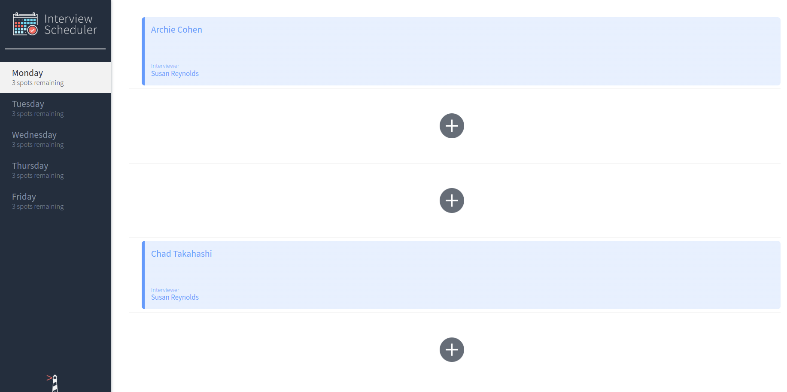
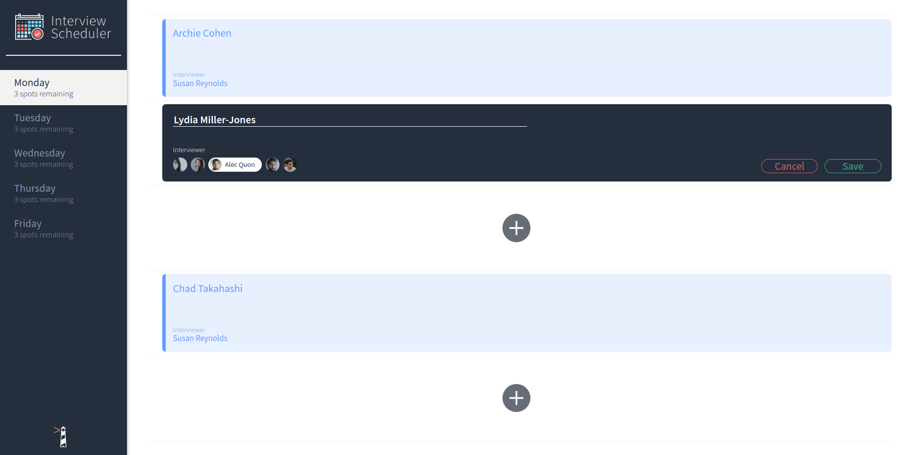
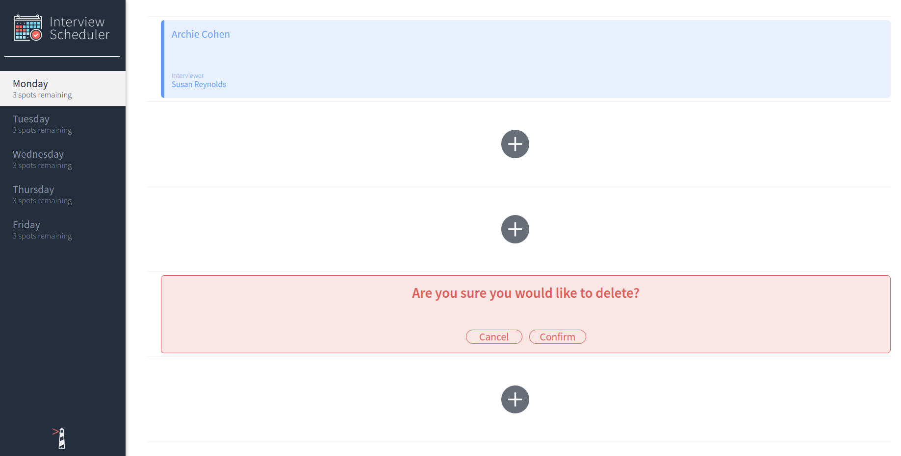

# Interview Scheduler

The client is created using Create React App while the API server is deployed using Express.

This repository contains implementation for the client application using React view library. The server-side api implementation is located [here](https://github.com/Vuvvy1/scheduler-api).

## Screenshots

### Main Page


### Book/Edit Interview


### Delete Interview


## Dependencies

- [Axios](https://www.npmjs.com/package/axios)
- [React](https://reactjs.org/) v16.9.0
- [React-dom](https://reactjs.org/) v16.9.0
- [React-scripts](https://reactjs.org/) v3.4.4
- [react-test-renderer](https://reactjs.org/docs/test-renderer.html) v16.9.0
- [Storybook](https://storybook.js.org/) v5.0.10
- [Node-sass](https://www.npmjs.com/package/node-sass) v1.53.0
- [@testing-library/react](https://testing-library.com/docs/react-testing-library/intro/) v8.0.7
- [@testing-library/jest-dom](https://testing-library.com/docs/dom-testing-library/intro) v4.0.0
- [Babel](https://babeljs.io/)

## Getting Started

In order to run this application, you will need to have NPM installed. If you do not know what NPM is or would like to learn more about it, visit this [website](https://docs.npmjs.com/about-npm).

### Installation

_Prior to installation make sure you go into the directory where you would like scheduler to reside._ 

1. Clone the repo
  ```sh
  git clone https://github.com/Vuvvy1/scheduler.git
  ```
2. Inside the scheduler directory, install all dependencies
  ```sh
  npm install
  ```
3a. Start Webpack Development Server
  ```sh
  npm start
  ```
3b. Start Jest Test Framework
```sh
npm test
```
3c. Start Storybook Visual Testbed
```sh
npm run storybook
```
4. Go to <http://localhost:8000/> in your browser.

## Usage

Once the server is running, you will be able to see and schedule interviews as a user. The following features are available upon application launch:
- Interviews can be booked between Monday and Friday wiith number of spots available for each.
- A user can book an interview in an empty appointment slot.
- Interviews are booked by typing in a student name and clicking on an interviewer from a list of available interviewers.
- A user can cancel an existing interview.
- A user can edit the details of an existing interview.
- The application makes API requests to load and persist data. We do not lose data after a browser refresh.
- When a user books or cancels an interview, all connected users see the update in their browser.

Keep in mind that this application just simulates booking interviews on pre-defined interviewers. The scheduler itself is not tied to a calendar with real-time sms notifications.

## Roadmap

:heavy_check_mark: Create React Components for Buttons, DayItem and DayList

:heavy_check_mark: Create React Components for InterviewerList, InterviewerItem and Appointment

:heavy_check_mark: Implement Axios API requests and set States

:heavy_check_mark: Implement Create, Delete and Edit Interviews

:heavy_check_mark: Implement Spot Remaining check

:heavy_check_mark: Jest Unit and Integration testing

:heavy_check_mark: Cypress End-to-End testing